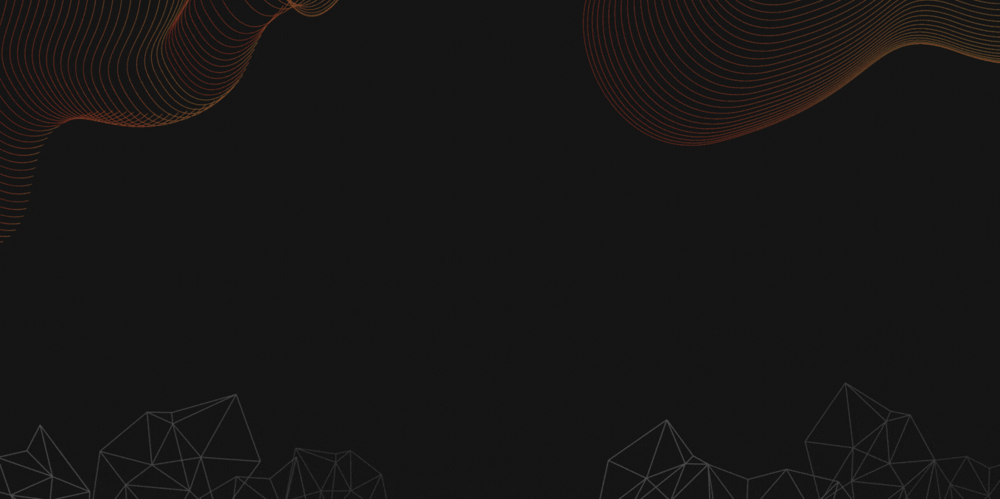

<!--- Made in https://canva.com --->

<h1 align="center">Hi there 👋, I'm Kemal</h1>
<h3 align="center" style="font-weight: bold">A Flutter enthusiast</h3>

 

I love building apps with Flutter because the framework provides lots of resources and good documentation to learn from.

I may have less experience, but I will continue to learn more and more until I can become a good developer. Wish me luck 😊.

## 🤝 Connect with me

- 💬 Feel free to ask me about Dart/Flutter

## 🌱 I’m currently learning...

- Continuous Integration/Deployment (CI/CD)
- Performance and Security (App profiling, encryption, and SSL Pinning)
- Post-Development (Firebase Analytics and Crashlytics)

## 🔭 I’m currently working on ...

- Cloning some popular app using Flutter.
- Cloning UI from Dribble using Flutter.
- My own app using TMDb API.
- My CV and Portfolio.

## 💻 Tech Skills

<!--  -->

 

 

<!--  -->
<!--  -->

## 📈 GitHub Stats

<!--- https://github.com/anuraghazra/github-readme-stats --->

<!---
KeidsID/KeidsID is a ✨ special ✨ repository because its `README.md` (this file) appears on your GitHub profile.
You can click the Preview link to take a look at your changes.

Here are some ideas to get you started:

- 🔭 I’m currently working on ...
- 🌱 I’m currently learning ...
- 👯 I’m looking to collaborate on ...
- 🤔 I’m looking for help with ...
- 💬 Ask me about ...
- 📫 How to reach me: ...
- 😄 Pronouns: ...
- ⚡ Fun fact: ...
--->
